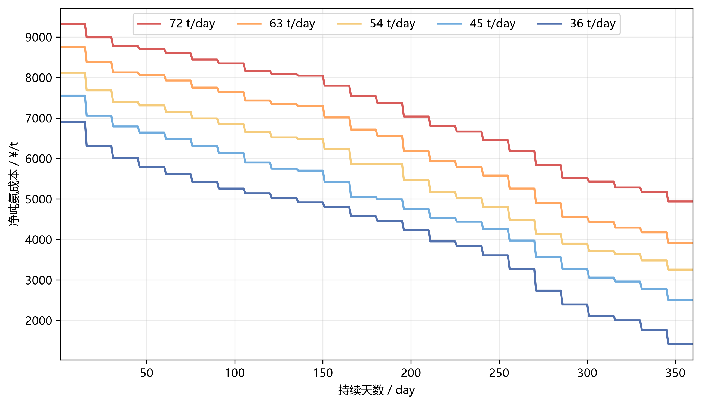
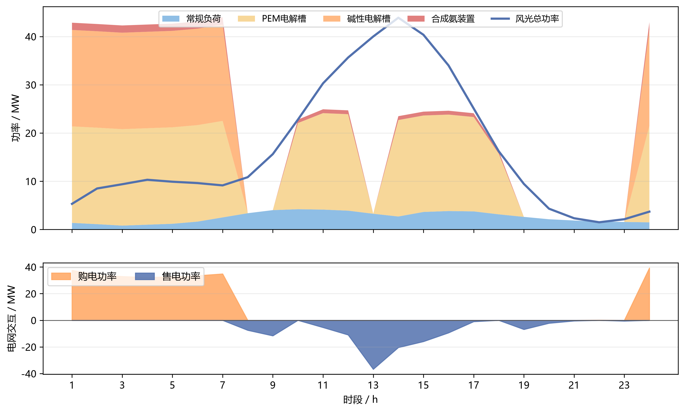
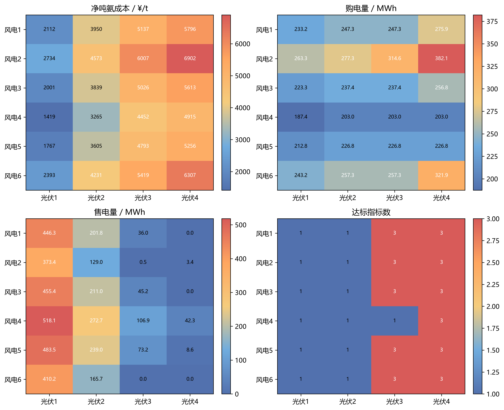
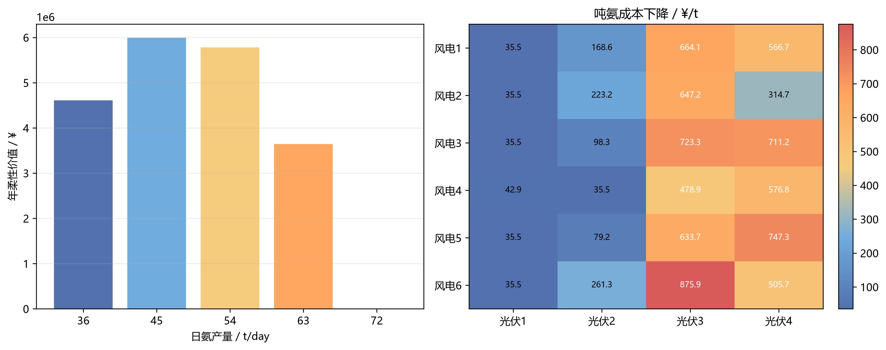

# 问题三计算结果

## 方法与口径

采用半连续混合整数线性规划。ALK、PEM和合成氨装置分别允许停机或在额定功率的10%至100%之间连续调节，不设置电储能和氢储能。每组场景依次执行“净成本最小、购电量最小、售电量最小”的词典序求解。风光成本按实际发电量核算，合成氨投资折旧单独计入固定成本，设备运维按实际功率核算。

## 问题三（1）年度结果

|   日氨产量(t/day) |   年氨产量(t/year) |   年综合净成本(¥/year) |   综合净吨氨成本(¥/t) |   全部达标天数(day) |   部分达标天数(day) |   全部不达标天数(day) |   全年新能源自发自用比例(%) |   全年新能源供电占比(%) |   全年上网电量比例(%) |
|------------------:|-------------------:|-----------------------:|----------------------:|--------------------:|--------------------:|----------------------:|----------------------------:|------------------------:|----------------------:|
|            72.000 |          25920.000 |          187358379.382 |              7228.333 |             270.000 |              90.000 |                 0.000 |                      85.902 |                  41.868 |                 7.049 |
|            63.000 |          22680.000 |          145490145.995 |              6414.909 |             300.000 |              60.000 |                 0.000 |                      85.889 |                  47.774 |                 7.055 |
|            54.000 |          19440.000 |          110287161.557 |              5673.208 |             240.000 |             120.000 |                 0.000 |                      78.633 |                  53.148 |                10.683 |
|            45.000 |          16200.000 |           80889979.679 |              4993.209 |             225.000 |             135.000 |                 0.000 |                      56.794 |                  55.772 |                21.603 |
|            36.000 |          12960.000 |           54816124.197 |              4229.639 |             165.000 |             195.000 |                 0.000 |                      26.081 |                  54.694 |                36.959 |

在给定五档候选产量、且仅以综合净吨氨成本最低为标准时，最低成本对应日产量为 **36 t/day**，综合净吨氨成本为 **4229.64 ¥/t**，年综合净成本为 **54816124.20 ¥**。该结论不是兼顾产能规模与政策指标后的综合产能推荐。

最低成本对应产量下，最低吨氨成本场景为 **风电4-光伏1**，成本 **1418.85 ¥/t**；最高成本场景为 **风电2-光伏4**，成本 **6901.82 ¥/t**。



## 问题三（2）场景机理分析

### 五档产量运行概览

|   日氨产量(t/day) |   平均购电量(MWh/day) |   购电量最小值(MWh/day) |   购电量最大值(MWh/day) |   平均售电量(MWh/day) |   售电量最小值(MWh/day) |   售电量最大值(MWh/day) |   平均吨氨成本(¥/t) |   吨氨成本最小值(¥/t) |   吨氨成本最大值(¥/t) |   全年新能源自发自用比例(%) |   全年新能源供电占比(%) |   全年上网电量比例(%) |   全部达标天数(day) |   部分达标天数(day) |   全部不达标天数(day) |
|------------------:|----------------------:|------------------------:|------------------------:|----------------------:|------------------------:|------------------------:|--------------------:|----------------------:|----------------------:|----------------------------:|------------------------:|----------------------:|--------------------:|--------------------:|----------------------:|
|            72.000 |               614.297 |                 353.502 |                 886.776 |                33.552 |                   0.000 |                 173.706 |            7228.333 |              4935.962 |              9318.906 |                      85.902 |                  41.868 |                 7.049 |             270.000 |              90.000 |                 0.000 |
|            63.000 |               483.611 |                 224.188 |                 753.705 |                33.582 |                   0.000 |                 173.706 |            6414.909 |              3908.970 |              8751.089 |                      85.889 |                  47.774 |                 7.055 |             300.000 |              60.000 |                 0.000 |
|            54.000 |               374.766 |                 188.954 |                 632.776 |                50.850 |                   0.000 |                 266.460 |            5673.208 |              3253.245 |              8118.216 |                      78.633 |                  53.148 |                10.683 |             240.000 |             120.000 |                 0.000 |
|            45.000 |               295.916 |                 188.954 |                 506.696 |               102.826 |                   0.000 |                 399.531 |            4993.209 |              2500.475 |              7550.376 |                      56.794 |                  55.772 |                21.603 |             225.000 |             135.000 |                 0.000 |
|            36.000 |               248.558 |                 187.390 |                 382.132 |               175.918 |                   0.000 |                 518.094 |            4229.639 |              1418.852 |              6901.816 |                      26.081 |                  54.694 |                36.959 |             165.000 |             195.000 |                 0.000 |

五档产量的24种场景均已纳入统计。产量下降时，连续调节空间扩大，生产负荷可以更多转移到风光充足或电价较低的时段；与此同时，较低生产负荷也可能扩大余电上网，因此三项绿电指标必须结合购电量、售电量和新能源总量共同判断。

### 最低成本对应产量的代表场景

| 代表类型   | 场景        |   新能源总发电量(MWh) |   高电价时段新能源占比(%) |   原始缺电面积(MWh) |   购电量(MWh) |   售电量(MWh) |   购电成本(¥/day) |   售电收入(¥/day) |   净吨氨成本(¥/t) |   新能源自发自用比例(%) |   新能源供电占比(%) |   上网电量比例(%) | 达标状态   |
|:-----------|:------------|----------------------:|--------------------------:|--------------------:|--------------:|--------------:|------------------:|------------------:|------------------:|------------------------:|--------------------:|------------------:|:-----------|
| 最低成本   | 风电4-光伏1 |               876.924 |                    42.339 |               0.000 |       187.390 |       518.094 |         64162.336 |        195787.722 |          1418.852 |                 -18.162 |              65.693 |            59.081 | 部分达标   |
| 中位成本   | 风电2-光伏2 |               400.344 |                    51.536 |               0.138 |       277.336 |       128.960 |         94996.606 |         48734.135 |          4572.537 |                  35.575 |              49.458 |            32.212 | 部分达标   |
| 最高成本   | 风电2-光伏4 |               169.944 |                    35.918 |               0.138 |       382.132 |         3.356 |        159032.663 |          1268.157 |          6901.816 |                  96.051 |              30.359 |             1.975 | 全部达标   |

在 36 t/day 下，最低成本场景 **风电4-光伏1** 的购电量为 **187.39 MWh**、售电量为 **518.09 MWh**；最高成本场景 **风电2-光伏4** 的购电量为 **382.13 MWh**、售电量为 **3.36 MWh**。场景成本差异主要由新能源总量、风光在高电价时段的分布以及原始缺电面积共同形成：新能源总量决定总体供需缺口，高电价时段新能源量决定昂贵购电的替代程度，原始缺电面积刻画风光与常规负荷的时序错配。售电收入会降低净成本，但余电过多也会抬高上网电量比例并压低新能源自发自用比例。





### 描述性关联

使用新能源总发电量、高电价时段新能源占比和原始缺电面积三个外生特征。以下相关系数固定在最低成本对应产量 36 t/day，仅用于描述性关联，不解释为因果贡献；全部五档产量的完整相关结果保存在结果工作簿中。

### 最强描述性关联

|   日氨产量(t/day) | 场景特征                | 运行结果              |   Spearman描述性相关系数 |
|------------------:|:------------------------|:----------------------|-------------------------:|
|                36 | 新能源总发电量(MWh)     | 净吨氨成本(¥/t)       |                  -0.9991 |
|                36 | 新能源总发电量(MWh)     | 售电量(MWh)           |                   0.9793 |
|                36 | 新能源总发电量(MWh)     | 上网电量比例(%)       |                   0.9774 |
|                36 | 新能源总发电量(MWh)     | 新能源自发自用比例(%) |                  -0.9730 |
|                36 | 高电价时段新能源占比(%) | 售电量(MWh)           |                   0.6832 |
|                36 | 高电价时段新能源占比(%) | 上网电量比例(%)       |                   0.6809 |

### 风光边际均值

|   最低成本对应日产量(t/day) | 因素   |   水平 |   平均吨氨成本(¥/t) |   平均购电量(MWh) |   平均售电量(MWh) |   平均达标指标数 |
|----------------------------:|:-------|-------:|--------------------:|------------------:|------------------:|-----------------:|
|                      36.000 | 风电   |      1 |            4248.734 |           250.927 |           171.011 |            2.000 |
|                      36.000 | 风电   |      2 |            5053.834 |           309.332 |           126.556 |            2.000 |
|                      36.000 | 风电   |      3 |            4119.854 |           238.745 |           177.905 |            2.000 |
|                      36.000 | 风电   |      4 |            3512.677 |           199.123 |           234.992 |            1.500 |
|                      36.000 | 风电   |      5 |            3855.078 |           223.310 |           201.050 |            2.000 |
|                      36.000 | 风电   |      6 |            4587.659 |           269.913 |           143.993 |            2.000 |
|                      36.000 | 光伏   |      1 |            2070.808 |           227.187 |           447.819 |            1.000 |
|                      36.000 | 光伏   |      2 |            3910.442 |           241.527 |           203.183 |            1.000 |
|                      36.000 | 光伏   |      3 |            5139.081 |           247.741 |            43.636 |            2.667 |
|                      36.000 | 光伏   |      4 |            5798.226 |           277.779 |             9.034 |            3.000 |

## 问题三（3）相对问题二的柔性价值

|   日氨产量(t/day) |   年柔性价值(¥/year) |   单位吨氨柔性价值(¥/t) |   平均日成本节约(¥/day) |   中位日成本节约(¥/day) |   最小日成本节约(¥/day) |   最大日成本节约(¥/day) |   成本改善场景数 |   成本相同场景数 |   平均购电量变化(MWh) |   平均售电量变化(MWh) |
|------------------:|---------------------:|------------------------:|------------------------:|------------------------:|------------------------:|------------------------:|-----------------:|-----------------:|----------------------:|----------------------:|
|            72.000 |                0.000 |                   0.000 |                   0.000 |                   0.000 |                   0.000 |                   0.000 |            0.000 |           24.000 |                -0.000 |                 0.000 |
|            63.000 |          3641272.857 |                 160.550 |               10114.647 |                9254.974 |                4585.586 |               16111.457 |           24.000 |            0.000 |               -26.006 |               -19.790 |
|            54.000 |          5780103.550 |                 297.330 |               16055.843 |               16853.791 |                1061.784 |               29252.924 |           24.000 |            0.000 |               -42.595 |               -34.766 |
|            45.000 |          5996702.189 |                 370.167 |               16657.506 |               16883.389 |                1728.091 |               35735.393 |           24.000 |            0.000 |               -59.577 |               -45.422 |
|            36.000 |          4607378.507 |                 355.508 |               12798.274 |               10368.284 |                1279.000 |               31531.277 |           24.000 |            0.000 |               -49.435 |               -39.331 |

最低成本对应产量下年柔性价值为 **4607378.51 ¥/year**，单位吨氨柔性价值为 **355.51 ¥/t**。连续模型成本高于离散模型超过0.05 ¥/day的配对数为 **0**。

### 全年绿电指标变化

|   日氨产量(t/day) |   问题二新能源自发自用比例(%) |   问题三新能源自发自用比例(%) |   新能源自发自用比例变化(百分点) |   问题二新能源供电占比(%) |   问题三新能源供电占比(%) |   新能源供电占比变化(百分点) |   问题二上网电量比例(%) |   问题三上网电量比例(%) |   上网电量比例变化(百分点) |
|------------------:|------------------------------:|------------------------------:|---------------------------------:|--------------------------:|--------------------------:|-----------------------------:|------------------------:|------------------------:|---------------------------:|
|            72.000 |                        85.902 |                        85.902 |                            0.000 |                    41.868 |                    41.868 |                       -0.000 |                   7.049 |                   7.049 |                      0.000 |
|            63.000 |                        77.573 |                        85.889 |                            8.316 |                    45.333 |                    47.774 |                        2.441 |                  11.213 |                   7.055 |                     -4.158 |
|            54.000 |                        64.025 |                        78.633 |                           14.608 |                    48.329 |                    53.148 |                        4.819 |                  17.987 |                  10.683 |                     -7.304 |
|            45.000 |                        37.708 |                        56.794 |                           19.086 |                    47.968 |                    55.772 |                        7.804 |                  31.146 |                  21.603 |                     -9.543 |
|            36.000 |                         9.555 |                        26.081 |                           16.526 |                    46.665 |                    54.694 |                        8.029 |                  45.223 |                  36.959 |                     -8.263 |

### 全年达标状态变化

|   日氨产量(t/day) |   问题二全部达标天数(day) |   问题三全部达标天数(day) |   问题二部分达标天数(day) |   问题三部分达标天数(day) |   问题二全部不达标天数(day) |   问题三全部不达标天数(day) |
|------------------:|--------------------------:|--------------------------:|--------------------------:|--------------------------:|----------------------------:|----------------------------:|
|                72 |                       270 |                       270 |                        90 |                        90 |                           0 |                           0 |
|                63 |                       210 |                       300 |                       150 |                        60 |                           0 |                           0 |
|                54 |                       210 |                       240 |                       135 |                       120 |                          15 |                           0 |
|                45 |                        15 |                       225 |                       285 |                       135 |                          60 |                           0 |
|                36 |                         0 |                       165 |                       315 |                       195 |                          45 |                           0 |

72 t/day 下三套设备需要全天满负荷运行，连续调节可行域退化为问题二的全开状态，因此成本和绿电指标不变。其余产量下，连续模型通过降低全开全停的粒度损失、优先使用制氢效率较高的PEM并由ALK补充、把生产负荷迁移到风光充足或电价更合适的时段，平均减少购电和售电，提高新能源自发自用比例与新能源供电占比，并降低上网电量比例。购售电量变化不预设方向，以120组配对结果为准。



## 约束与一致性校验

| 校验项                     |   120组最大值 |
|:---------------------------|--------------:|
| 最大功率平衡残差(MW)       |     7.105e-15 |
| 最大氢氨物料平衡残差(kg/h) |     5.684e-13 |
| 日产量约束残差(MWh)        |     1.421e-14 |
| 半连续边界最大违反量(MW)   |     9.684e-07 |
| 购售电同时发生最大值(MW2)  |     0.000e+00 |
| 一级目标重算残差(¥/day)    |     1.534e-05 |
| 三级成本容差(¥/day)        |     5.232e-05 |

- 场景—产量组合数：120。
- 逐时结果行数：2880。
- 每档产量的全年状态天数均为360 day。
- 连续模型可行域包含问题二离散模型；若出现显著负节约，应检查成本或约束口径。

## 文件说明

- `outputs/问题三计算结果/问题三计算结果.xlsx`：全部结果工作簿。
- `outputs/问题三计算结果/问题三全部场景汇总.csv`：120组汇总结果。
- `outputs/问题三计算结果/问题三全部场景逐时调度.csv`：2880行逐时结果。
- `outputs/问题三计算结果/问题三五档产量运行概览.csv`：五档产量的购售电、成本和全年指标概览。
- `outputs/问题三计算结果/问题三代表场景机理.csv`：最低、中位和最高成本代表场景。
- `outputs/问题三计算结果/问题二与问题三比较.csv`：120组配对结果。
- `outputs/问题三计算结果/问题二三全年指标变化.csv`：问题二、三全年绿电指标和达标状态变化。
- `figures/问题三计算结果/`：四组论文可用PNG和PDF图形，报告正文均已引用。

## 可复现运行方式

```powershell
python -X utf8 code/问题三.py --self-test
python -X utf8 code/问题三.py
```
