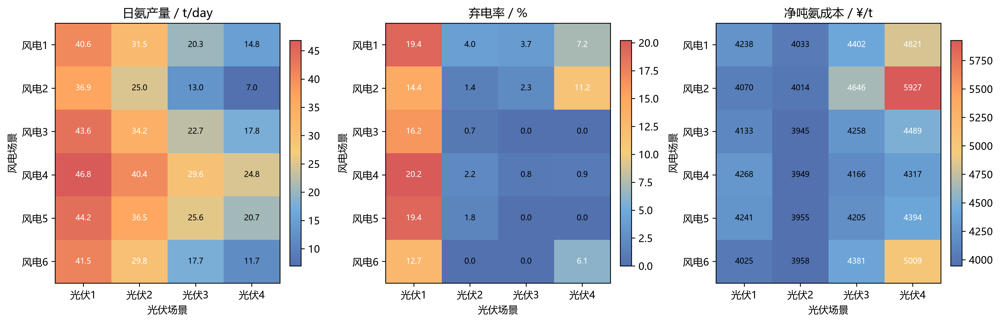
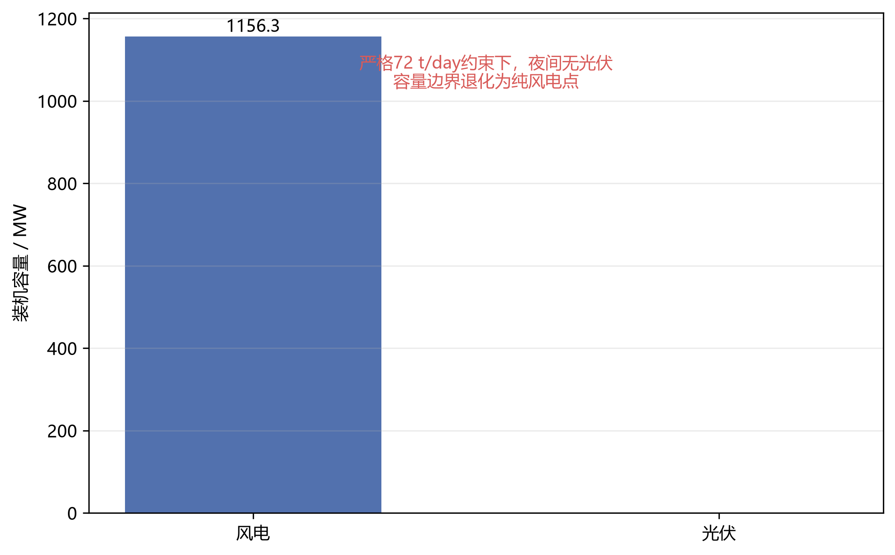
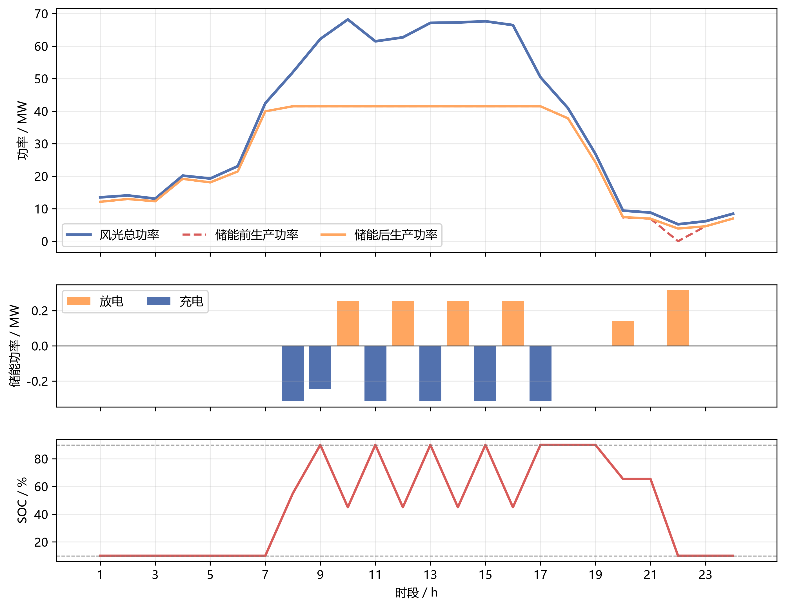
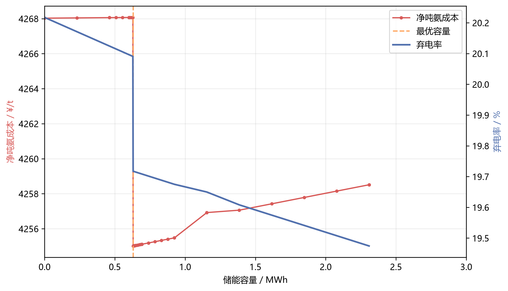
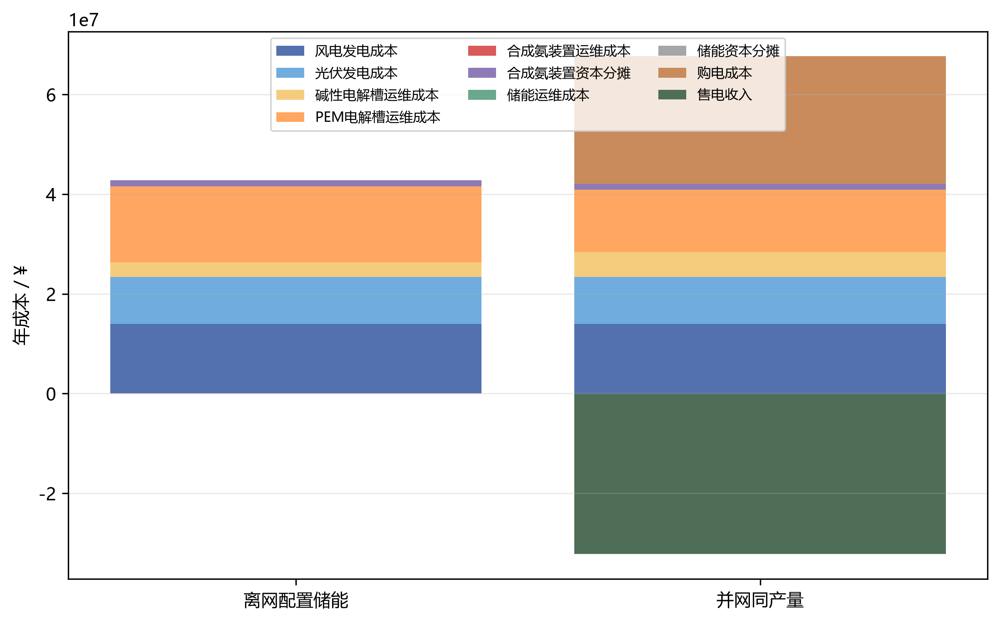

# 问题四计算结果

## 方法与统一口径

无储能离网调度采用逐时8种设备启停状态枚举，并按“常规负荷失供最小、合成氨产量最大、弃电最小、运行成本最小”执行词典序求解。储能模型采用2 h、0.5C，SOC范围10%至90%，首末SOC自由循环，0.2%/day自损耗换算为小时自损耗。固定投资按365 day/year日化，24种场景各代表15 day，全年按360个典型运行日累计。

## 问题四（1）无储能离网运行

| 运行模式 | 年氨产量(t/year) | 年综合净成本(¥/year) | 综合净吨氨成本(¥/t) | 全年弃电量(MWh/year) | 全年负荷失供量(MWh/year) | 全年购电量(MWh/year) | 全年售电量(MWh/year) | 新能源利用率(%) | 常规负荷供电保障率(%) | 本地电力自给率(%) | 制氢装置平均利用率(%) | 合成氨装置平均利用率(%) |
| --- | --- | --- | --- | --- | --- | --- | --- | --- | --- | --- | --- | --- |
| 离网无储能 | 10148.555 | 42667953.158 | 4204.338 | 13893.063 | 8.292 | 0.000 | 0.000 | 91.892 | 99.962 | 100.000 | 39.153 | 39.153 |

24种场景中最大弃电场景为 **风电4-光伏1**。日制氨量范围为 **6.952–46.837 t/day**，场景吨氨成本范围为 **3944.89–5927.15 ¥/t**。

离网模式没有外部购电，因此本地电力自给率为100%；该指标只表示实际用电全部来自园区风光。能源充足程度另由常规负荷供电保障率和氢氨装置产能利用率衡量，避免把“没有购电”误写成“能够满产”。



### 严格能源自治容量边界

- 最小总装机点：风电 **1156.306 MW**，光伏 **0.000 MW**，总装机 **1156.306 MW**；
- 最小年供电成本点：风电 **1156.306 MW**，光伏 **0.000 MW**，年风光供电成本 **405075485.11 ¥**。

第二个点依据度电成本计算，只称为“最小年供电成本点”，不称为最小投资点。

严格72 t/day要求意味着合成氨装置必须24 h满功率运行；控制性约束出现在无光伏的夜间，故本数据下风光容量Pareto边界退化为纯风电单点。



## 问题四（2）储能配置

最大弃电场景的最优储能容量为 **0.630 MWh**，对应日氨产量 **47.148 t/day**、弃电率 **19.717%**、净吨氨成本 **4255.02 ¥/t**。该容量固定应用于全部24种场景后，年度结果如下。

| 运行模式 | 年氨产量(t/year) | 年综合净成本(¥/year) | 综合净吨氨成本(¥/t) | 全年弃电量(MWh/year) | 全年负荷失供量(MWh/year) | 全年购电量(MWh/year) | 全年售电量(MWh/year) | 新能源利用率(%) | 常规负荷供电保障率(%) | 本地电力自给率(%) | 制氢装置平均利用率(%) | 合成氨装置平均利用率(%) |
| --- | --- | --- | --- | --- | --- | --- | --- | --- | --- | --- | --- | --- |
| 离网配置储能 | 10202.041 | 42814470.149 | 4196.657 | 13130.902 | 0.000 | 0.000 | 0.000 | 92.337 | 100.000 | 100.000 | 39.360 | 39.360 |

与无储能方案相比，配置储能后年制氨量变化 **+53.486 t/year**，全年弃电量变化 **-762.161 MWh/year**，新能源利用率变化 **+0.445 个百分点**，常规负荷失供量变化 **-8.292 MWh/year**，综合净吨氨成本变化 **-7.680 ¥/t**，制氢装置平均利用率变化 **+0.206 个百分点**。其中负号表示弃电、失供或成本下降。





### 灵敏度分析

| 敏感性类型 | 参数 | 最优储能容量(MWh) | 日氨产量(t/day) | 弃电率(%) | 净吨氨成本(¥/t) |
| --- | --- | --- | --- | --- | --- |
| 储能时长 | 1 h/1C | 0.437 | 47.137 | 19.731 | 4254.830 |
| 储能时长 | 2 h/0.5C | 0.630 | 47.148 | 19.717 | 4255.018 |
| 储能时长 | 4 h/0.25C | 1.259 | 47.183 | 19.657 | 4255.763 |
| 日自损耗率 | 0.1%/day | 0.629 | 47.148 | 19.717 | 4255.017 |
| 日自损耗率 | 0.2%/day | 0.630 | 47.148 | 19.717 | 4255.018 |
| 日自损耗率 | 0.3%/day | 0.629 | 47.148 | 19.717 | 4255.018 |
| 储能投资成本 | 0.8× | 0.629 | 47.148 | 19.717 | 4254.530 |
| 储能投资成本 | 1.0× | 0.630 | 47.148 | 19.717 | 4255.018 |
| 储能投资成本 | 1.2× | 0.629 | 47.148 | 19.717 | 4255.505 |

储能时长结果呈现“倍率越低、达到同一启停收益台阶所需能量容量越大”的规律。日自损耗0.1%–0.3%/day以及投资成本±20%均未改变最优启停组合，因此最优容量稳定在约0.63 MWh的最小可行阈值附近；所有分支均重新执行容量寻优，并非在主方案容量上事后重算成本。

## 问题四（3）并离网经济性

并网模式逐场景锁定为与离网储能模式相同的合成氨产量。两种模式年度结果如下。

本地电力自给率按“1－购电量/园区终端用电量”计算；常规负荷供电保障率只反映常规负荷是否失供，两者不再混用。

| 运行模式 | 年氨产量(t/year) | 年综合净成本(¥/year) | 综合净吨氨成本(¥/t) | 全年弃电量(MWh/year) | 全年负荷失供量(MWh/year) | 全年购电量(MWh/year) | 全年售电量(MWh/year) | 新能源利用率(%) | 常规负荷供电保障率(%) | 本地电力自给率(%) | 制氢装置平均利用率(%) | 合成氨装置平均利用率(%) |
| --- | --- | --- | --- | --- | --- | --- | --- | --- | --- | --- | --- | --- |
| 离网配置储能 | 10202.041 | 42814470.149 | 4196.657 | 13130.902 | 0.000 | 0.000 | 0.000 | 92.337 | 100.000 | 100.000 | 39.360 | 39.360 |
| 并网同产量 | 10202.041 | 35468605.531 | 3476.619 | 0.000 | 0.000 | 74622.660 | 85220.120 | 100.000 | 100.000 | 53.579 | 39.360 | 39.360 |

电网年度系统支撑价值为 **7345864.62 ¥/year**，单位制氨量支撑价值为 **720.04 ¥/t**。该值表示在相同场景产量下，接入主电网后减少的年度净成本，不使用MILP对偶变量进行边际价格解释。



## 约束校验

| 校验项 | 最大值 |
| --- | --- |
| 最大功率平衡残差(MW) | 0.00000000 |
| 最大氢氨物料平衡残差(kg/h) | 0.00000000 |
| 最大半连续边界违反(MW) | 0.00000000 |
| 最大同时充放电功率(MW) | 0.00000000 |
| 最大SOC及倍率边界违反(MWh) | 0.00000000 |
| 最大储能动态残差(MWh) | 0.00000000 |

全部输出均按逐时电力平衡、氢氨物料平衡、半连续功率边界、充放电互斥、SOC边界和储能循环状态重新回代校验。

## 可复现运行方式

```powershell
python -X utf8 code/问题四.py --self-test
python -X utf8 code/问题四.py
```
